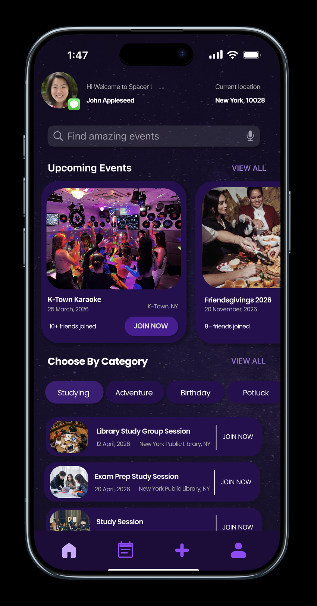
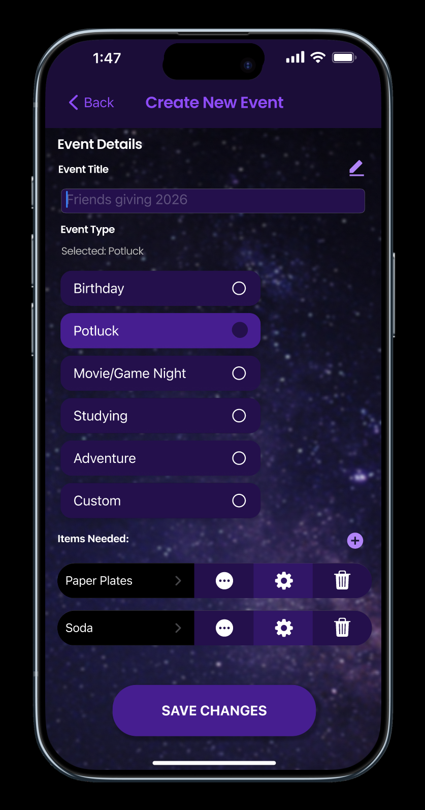
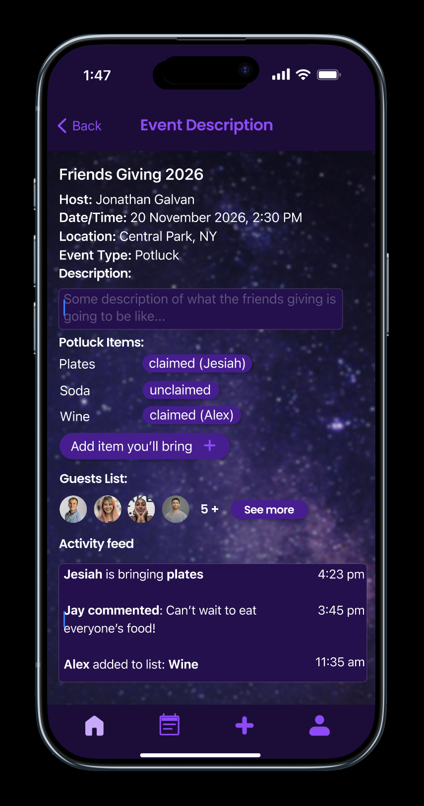
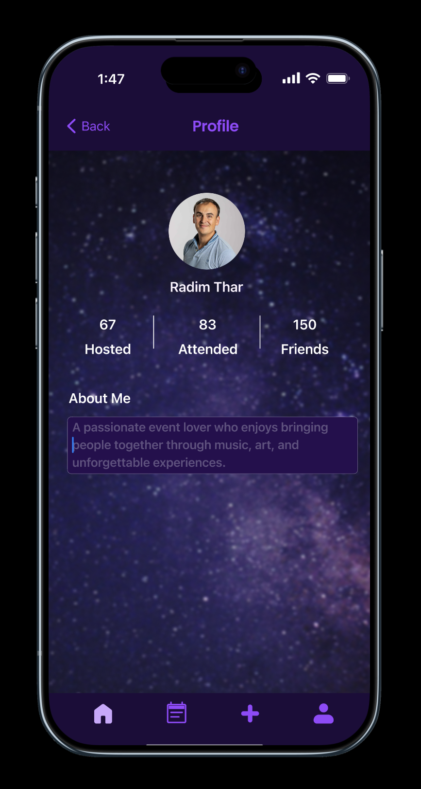

# Spacer

Spacer is a mobile event planning application that helps users create events, coordinate with friends, manage shared items (such as potlucks), and determine the best time for everyone to meet. The goal of the project is to simplify organizing group events while keeping communication and scheduling in one place.

---

# Demo / Screenshots

---

# Features

- Create and manage events
- Invite friends and track attendance
- Potluck item claiming system
- Activity feed for event updates
- Smart scheduling based on availability
- User profiles and event history

---

# Tech Stack

### Languages
- Kotlin
- SQL
- JavaScript

### Frameworks / Tools
- Android Studio
- Docker
- PostgreSQL
- Git / GitHub

### APIs / Integrations
- Google OAuth
- Google Maps
- Google Calendar
- Groq Cloud

---

# Installation

Explain how someone runs the project.

Download the latest stable apk in github repo.
---

# Future Improvements

Optional section for planned features.

- Smarter event suggestions
- Real-time notifications
- Messaging between guests
- Calendar syncing
- Improved scheduling algorithm

---

This project is under the MIT liscense 
